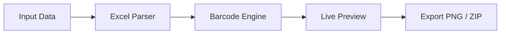

<div align="center">


</div>

<br>

<p align="center">
  <b style="font-size:18px;">
    Smart Barcode System for Modern Universities
  </b>
</p>

<p align="center">
Generate, manage, and export student barcodes with precision, speed, and elegance.
</p>

<br>

<p align="center">
  <a href="https://ahmadaizazdev.github.io/UniScanPro/">
    
  </a>
  <a href="https://github.com/ahmadaizazdev/UniScanPro">
    
  </a>
</p>

---

<br>

## Overview

UniScan Pro is a lightweight, high-performance barcode generation system designed for educational institutions. It removes manual effort and brings automation into student identification workflows.

---

<br>

## Features

<div align="center">

| Precision               | Automation                  | Scalability               |
| ----------------------- | --------------------------- | ------------------------- |
| Manual Barcode Creation | Excel-Based Bulk Processing | Unlimited Record Handling |

</div>

<br>

* Instant barcode generation from student data
* Bulk Excel upload processing
* Smart file naming system
* One-click ZIP export
* Organized barcode gallery
* Fully frontend-based (no backend required)
* Optimized for speed and large datasets

---

<br>

## How It Works



---

<br>

## Output System

Each file is automatically structured for clarity and organization:

```text
StudentName_StudentID.png
```

Example:

```text
Ahmad_Aizaz_540621.png
Ali_Khan_540622.png
```

---

<br>

## Tech Foundation

| Layer          | Stack       |
| -------------- | ----------- |
| Structure      | HTML5       |
| Styling        | CSS3        |
| Logic          | JavaScript  |
| Barcode Engine | JsBarcode   |
| Data Handling  | SheetJS     |
| Compression    | JSZip       |
| Export Engine  | html2canvas |

---

<br>

## Design Philosophy

> Minimal. Fast. Functional. Clean.

UniScan Pro follows a **no-noise UI approach**, inspired by Apple’s design principles:

* Soft contrast
* Clean spacing
* Focused user flow
* Zero distraction interface

---

<br>

## Author

**Ahmad Aizaz**

<p align="center">
  <a href="https://github.com/ahmadaizazdev">
    
  </a>
</p>

---

<br>

<div align="center">


<br>

⭐ *Built for modern education systems*

</div>
